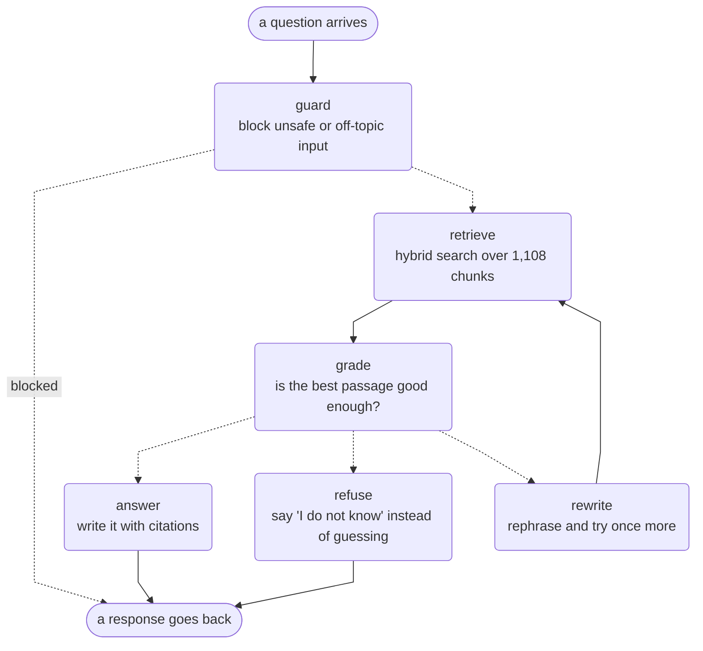

```mermaid
---
config:
  flowchart:
    curve: linear
---
graph TD;
	start([a question arrives])
	guard(guard<br/>block unsafe or off-topic input)
	retrieve(retrieve<br/>hybrid search over 1,108 chunks)
	grade(grade<br/>is the best passage good enough?)
	rewrite(rewrite<br/>rephrase and try once more)
	answer(answer<br/>write it with citations)
	refuse(refuse<br/>say 'I do not know' instead of guessing)
	done([a response goes back])
	start --> guard;
	grade -.-> answer;
	grade -.-> refuse;
	grade -.-> rewrite;
	guard -. &nbsp;blocked&nbsp; .-> done;
	guard -.-> retrieve;
	retrieve --> grade;
	rewrite --> retrieve;
	answer --> done;
	refuse --> done;
```
